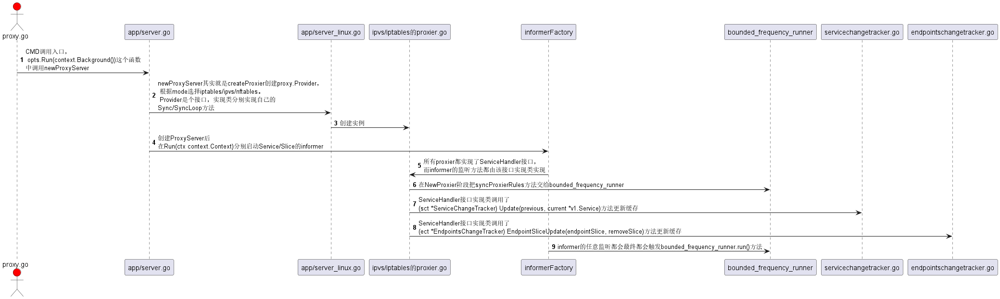

+++
title = 'Kube Proxy如何监听Service和Endpoint以及更新策略规则'
date = 2022-08-13T22:36:08+08:00
draft = false
tags = [
    "云原生",
    "Kubernetes",
    "网络通讯",
    "Kube-Proxy"
]
categories = [
    "Kubernetes",
    "Prometheus",
]
+++

本文会探讨Kubernetes另一个核心网络组件Kube-Proxy，它承担着Service及其后端Pod对宿主机配置的影响。

## 一、 先聊一下三个核心API

这三个API在不同版本下的Kube-Proxy发挥着主要作用，尤其是后两者。先上几个三个资源的常用配置一步步展开。

### 1. Service

`Service`作用核心其实就是提供一个ClusterIP和域名的配置容器以及EP/EPS组织，并没有一个单独的controller进行管理，而是被endpointslice-controller所控制。

```yaml
apiVersion: v1
kind: Service
metadata:
  name: my-service
  namespace: default
  labels:
    app: my-app
  annotations:
    description: "This is a demo service"
spec:
  selector:
    app: my-app
    tier: backend
  type: ClusterIP
  ports:
    - protocol: TCP
      port: 80
      targetPort: 8080
      name: http
  ## 粘性会话，一般用于长连接并且开启ClusterIP的场景
  sessionAffinity: None
  ## Cluster和Local，默认前者，后者用于本地流量请求
  ## 例如说，在Node1的PodA请求ServiceB，只能路由到Node1的ServiceB的Pod地址，如果本地没有则无法请求，报文会被iptables drop掉
  externalTrafficPolicy: Cluster
  ## 控制NotReady的Pod是否要包含进Service，为true的话有可能导致流量损失
  publishNotReadyAddresses: false
  ipFamilyPolicy: SingleStack
  ipFamilies:
    - IPv4
  healthCheckNodePort: 30009
```


### 2. Endpoints、EndpointSlice

`EndpointSlice`是在k8s 1.19版本开始默认支持的，相较于`Endpoints`能支持更大规模部署，受限于etcd的value值大小，ep即一个Service只能部署6000个节点，
而eps理论上可以无上限，并且eps支持网络拓扑，它可以根据集群节点的资源信息，按需部署Pod数量。具体文档在这[K8s文档-EndpointSlice](https://kubernetes.io/zh-cn/docs/concepts/services-networking/endpoint-slices/)

```yaml
apiVersion: discovery.k8s.io/v1
kind: EndpointSlice
metadata:
  annotations:
    ## 每一次Service或Pod改动都会update这个字段
    endpoints.kubernetes.io/last-change-trigger-time: "2022-08-19T03:32:20Z"
  generateName: python-server-headless-
  generation: 27
  labels:
    endpointslice.kubernetes.io/managed-by: endpointslice-controller.k8s.io
    kubernetes.io/service-name: python-server-headless
    service.kubernetes.io/headless: ""
  name: python-server-headless-5xvm5
  namespace: net-test
  ownerReferences:
    - apiVersion: v1
      blockOwnerDeletion: true
      controller: true
      kind: Service
      name: python-server-headless
      uid: fb7d24b3-c7cb-4b1a-8bc2-7caf2cb32101
  resourceVersion: "6538663"
  uid: d7475629-ac4f-46bc-9aeb-479417162ec3
addressType: IPv4
endpoints:
- addresses:
  - 10.100.58.221
  conditions:
    ready: true
    serving: true
    terminating: false
  nodeName: k8s-node02
  ## 控制器基本上靠着这些信息对eps进行增删改查
  targetRef:
    kind: Pod
    name: python-server-65b886d59c-nnktx
    namespace: net-test
    uid: b3cf8828-5311-44cc-b9b1-6e8165f793f4
ports:
  - name: ""
    port: 80
    protocol: TCP
```

## 二、Kube-Proxy的源码分析

首先我们还是需要先认识一下Kube-Proxy的整体架构：

- cmd/kube-proxy/app/server.go 这是程序主入口，对宿主机的参数和启动参数进行注入
	- cmd/kube-proxy/app/server_linux.go 对应不同编译平台的代码，这里会继续设置部分协议栈的一些配置，如nf_conntrack、iptables等
		- 这里就会应用到pkg/proxy中的各种 Proxy 创建器，根据不同设置有对应的代理
          - pkg/proxy/iptables/proxier.go 
          - pkg/proxy/ipvs/proxier.go
		- pkg/util/async/bounded_frequency_runner.go 这是控制更新iptables/ipvs的核心组件，可以自定义更新的频率窗口
        - 两个资源的同步器，被绑定在infomer的回调函数上，用来存储监听到的缓存
          - pkg/proxy/endpointschangetracker.go
          - pkg/proxy/servicechangetracker.go
          - 

<!--more-->

### 1. Kube-Proxy的相关配置

```go
package config

type KubeProxyConfiguration struct {
	/**
	 *  1. 设置masqueradeAll，即所有发送到Service的请求都做SNAT
	 *  2. oom_score_adj，默认值是-999，也就是在系统内存非常低的情况下，被OOMKiller的优先级最低
	 *  3. 几个比较重要的conntrack相关的系统参数
	 *      net.netfilter.nf_conntrack_tcp_timeout_established
	 *      net.netfilter.nf_conntrack_tcp_timeout_close_wait
	 *      net.netfilter.nf_conntrack_tcp_be_liberal
	 */
	Linux KubeProxyLinuxConfiguration
    // 开启一些实验性功能
	FeatureGates map[string]bool
	// client-go配置
	ClientConnection componentbaseconfig.ClientConnectionConfiguration

	HostnameOverride string
	BindAddress string

	// mode specifies which proxy mode to use.
	Mode ProxyMode
	/**
	 *  1. LocalhostNodePorts, false不允许回环地址访问NodePort，仅在iptables&ipv4生效
	    2. 
	 */
	IPTables KubeProxyIPTablesConfiguration
	// ipvs contains ipvs-related configuration options.
	IPVS KubeProxyIPVSConfiguration
	// nftables contains nftables-related configuration options.
	NFTables KubeProxyNFTablesConfiguration

	// 检测本地流量的模式，默认通过ClusterCIDR
	DetectLocalMode LocalMode
	// 网桥名称、ClusterCIDR、设备前缀等设置
	DetectLocal DetectLocalConfiguration

	// 指定哪些CIDR访问能使用NodePort暴露端口，比如数据库或特定的服务
	NodePortAddresses []string
	// 下面两个参数都应用在BoundedFrequencyRunner定时器中，Kube-Proxy更新的最高频率受限于MinSyncPeriod和内部burstRuns两个参数
	// 这是Proxy规则同步的最大间隔
	SyncPeriod metav1.Duration
    // 最小间隔
	MinSyncPeriod metav1.Duration
	ConfigSyncPeriod metav1.Duration
}
```

### 1.1 BoundedFrequencyRunner


### 2. Informer的监听函数和Provider.SyncLoop()


```go
package config
// NodeHandler is an abstract interface of objects which receive
// notifications about node object changes.
type NodeHandler interface {
	// OnNodeAdd is called whenever creation of new node object
	// is observed.
	OnNodeAdd(node *v1.Node)
	// OnNodeUpdate is called whenever modification of an existing
	// node object is observed.
	OnNodeUpdate(oldNode, node *v1.Node)
	// OnNodeDelete is called whenever deletion of an existing node
	// object is observed.
	OnNodeDelete(node *v1.Node)
	// OnNodeSynced is called once all the initial event handlers were
	// called and the state is fully propagated to local cache.
	OnNodeSynced()
}


type ServiceHandler interface {
	// OnServiceAdd is called whenever creation of new service object
	// is observed.
	OnServiceAdd(service *v1.Service)
	// OnServiceUpdate is called whenever modification of an existing
	// service object is observed.
	OnServiceUpdate(oldService, service *v1.Service)
	// OnServiceDelete is called whenever deletion of an existing service
	// object is observed.
	OnServiceDelete(service *v1.Service)
	// OnServiceSynced is called once all the initial event handlers were
	// called and the state is fully propagated to local cache.
	OnServiceSynced()
}

// EndpointSliceHandler is an abstract interface of objects which receive
// notifications about endpoint slice object changes.
type EndpointSliceHandler interface {
	// OnEndpointSliceAdd is called whenever creation of new endpoint slice
	// object is observed.
	OnEndpointSliceAdd(endpointSlice *discoveryv1.EndpointSlice)
	// OnEndpointSliceUpdate is called whenever modification of an existing
	// endpoint slice object is observed.
	OnEndpointSliceUpdate(oldEndpointSlice, newEndpointSlice *discoveryv1.EndpointSlice)
	// OnEndpointSliceDelete is called whenever deletion of an existing
	// endpoint slice object is observed.
	OnEndpointSliceDelete(endpointSlice *discoveryv1.EndpointSlice)
	// OnEndpointSlicesSynced is called once all the initial event handlers were
	// called and the state is fully propagated to local cache.
	OnEndpointSlicesSynced()
}

type ServiceCIDRHandler interface {
    // OnServiceCIDRsChanged is called whenever a change is observed
    // in any of the ServiceCIDRs, and provides complete list of service cidrs.
    OnServiceCIDRsChanged(cidrs []string)
}

// Provider is the interface provided by proxier implementations.
type Provider interface {
	config.EndpointSliceHandler
	config.ServiceHandler
	config.NodeHandler
	config.ServiceCIDRHandler

	// Sync immediately synchronizes the Provider's current state to proxy rules.
	Sync()
	// SyncLoop runs periodic work.
	// This is expected to run as a goroutine or as the main loop of the app.
	// It does not return.
	SyncLoop()
}
```