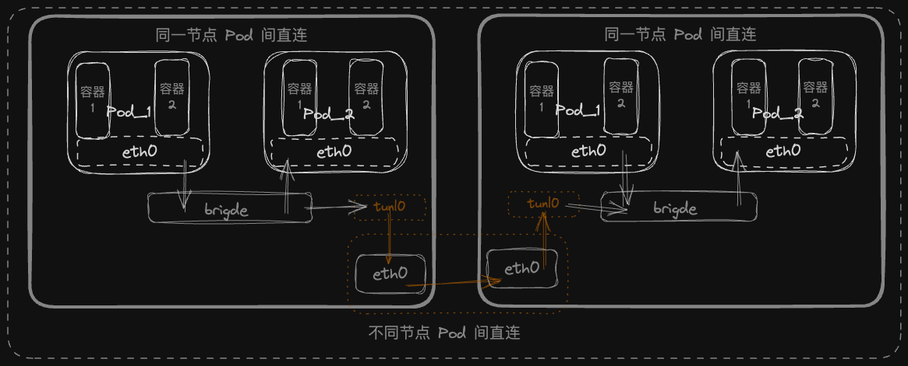
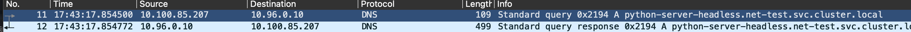
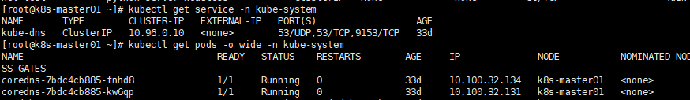

+++
title = '【长文】详细梳理Kubernetes的网络模型，总结网络故障排查核心思路'
date = 2022-06-03T14:26:11+08:00
draft = false
categories = [
    "云原生",
    "Kubernetes",
    "网络通讯",
    "CNI"
]
+++


本文旨在梳理网络模型，总结出通用并且高可行性的故障排查思路，并且能通过自动化检测减少中大规模集群的手动排查工作。
```text
默认读者已熟悉四层/七层网络模型，相关概念不再赘述
```


## 一、Linux中的基础网络技术

这里只会提及相关的Linux指令，不深入技术原理，只会一笔带过，不然文章会很冗长。

### 1. Network namespace

我们知道两个POD的网络相互隔离，实际在操作系统中是通过命名空间实现的。

Network namespace用于支持网络协议栈的多个实例。通过对网络资源的隔离，就能在一个宿主机上虚拟出多个不同的网络环境。docker利用NS实现了不同容器的网络隔离。
Network namespace可以提供独立的路由表和iptables来设置包转发、nat以及ip包过滤等功能，提供完整且独立的协议栈。

```shell
## 创建一个新的网络命名空间
sudo ip netns add my_namespace
## 进入my_namespace的内部 shell 界面
sudo ip netns exec my_namespace bash
```

### 2. veth设备对

那如何我们如何为两个不同命名空间下的进程之间实现通信呢？

可以通过引入Veth设备对，Veth设备都是成对出现的，其中一端成为另一端的peer，在Veth设备的一端发送数据时，会将数据发送到另一端，并触发接收数据的操作。
<!--more-->
```shell
sudo ip netns add ns1
sudo ip netns add ns2
## 创建一对 veth 设备，这里我们命名为 veth0 和 veth1，注意当前设备对为创建在任何命名空间中
sudo ip link add veth0 type veth peer name veth1
## 将 veth0 分配到 ns1，将 veth1 分配到 ns2，将peer转移到各自的命名空间
sudo ip link set veth0 netns ns1
sudo ip link set veth1 netns ns2
## 在ns1里能看到相关的设备信息
sudo ip netns exec ns1 ip link show

1: lo: <LOOPBACK,UP,LOWER_UP> mtu 65536 qdisc noqueue state UNKNOWN mode DEFAULT group default qlen 1000
    link/loopback 00:00:00:00:00:00 brd 00:00:00:00:00:00
2: veth0: <BROADCAST,MULTICAST,UP,LOWER_UP> mtu 1500 qdisc pfifo_fast state UP mode DEFAULT group default qlen 1000
    link/ether 01:23:45:67:89:ab brd ff:ff:ff:ff:ff:ff

## 为两个 veth 设备分配 IP 地址，确保它们在同一子网中
sudo ip netns exec ns1 ip addr add 192.168.1.1/24 dev veth0
sudo ip netns exec ns2 ip addr add 192.168.1.2/24 dev veth1
## 启动两个接口
sudo ip netns exec ns1 ip link set veth0 up
sudo ip netns exec ns2 ip link set veth1 up
## 可以在两个命名空间之间测试连接，可以从 ns1 ping ns2
sudo ip netns exec ns1 ping 192.168.1.2

## 可以通过 ethtool 工具可以在一端查看对端设接口
sudo ip netns exec ns1 ethtool -S veth0

NIC statistics:
     peer_ifindex: 3
```

### 3. 网桥bridge

在有多个网络命名空间和多个veth设备对的情况下，即在本机有多个POD，使用网桥（bridge）可以提供更好的管理和网络连通性，它充当一个虚拟的交换机，可以将多个网络接口连接在一起，使它们在同一个网络层次中互相通信。

```shell
## 创建并启动网桥
sudo ip link add name br0 type bridge
sudo ip link set br0 up

## 类似 calico 这种，放在网桥的设备名称通常是 caliXXXXXXX，而在 Pod 或者容器中的设备名称被命名为 eth0
sudo ip link add veth0 type veth peer name br-veth0
sudo ip link set br-veth0 master br0
sudo ip link set br-veth0 up

sudo ip link set veth0 netns ns1
sudo ip netns exec ns1 ip addr add 192.168.1.123/24 dev veth0
sudo ip netns exec ns1 ip link set veth0 up
```

经过以上创建veth设备和网桥后，执行`ip route`可以看到以下这行记录。calico为容器创建网络环境后，也会有类似的记录。
```shell
blackhole 192.168.1.123/26 proto bird
192.168.1.123 dev br-veth0 scope link

## 你在Kubernetes集群的节点执行同样的命令，能看到类似的记录
10.244.166.168 dev calie8098ed1v42d scope link
```

### 4. iptables转发功能

Kubernetes中通常不直接访问Pod IP，而是通过Service的ClusterIP访问，ClusterIP是一个虚拟的逻辑IP，通过iptables进行负载均衡+转发。

```shell
## 开启 IP 转发功能
sudo sysctl -w net.ipv4.ip_forward=1

## 这里关系到为什么PodIP报文都需要发至网关，后面会说明。
## 开启iptables支持对brigde的转发 
sudo sysctl net.bridge.bridge-nf-call-iptables=1
sudo sysctl net.bridge.bridge-nf-call-ip6tables=1
```

### 5. VxLan、IP-in-IP

- VxLan

目前主流CNI中，Flannel支持该模式

```shell
sudo modprobe vxlan

## 对点对可以用以下方式，比如仅有两个host分别是192.168.1.1和192.168.1.2
## sudo ip link add vxlan0 type vxlan id 42 dev eth0 remote 192.168.1.2 dstport 4789

## 如果有多台机器，可以基于交换机自持的多播组，这里指定多播组239.1.1.1
## 在每台机器执行该指令
## 需要注意一点，Flannel是通过监听etcd的Node资源变化来在本机添加的，并不是通用交换机的多播组，这是为了兼顾更多的集群网络场景
sudo ip link add vxlan0 type vxlan id 42 group 239.1.1.1 dev eth0 dstport 4789
## 启动
sudo ip link set vxlan0 up
## 在每台host添加属于自己的虚拟IP范围
sudo ip addr add 10.0.0.1/24 dev vxlan0
```

- IP-in-IP

Kubernetes的默认CNI calico的默认模式，另外一种叫BGP

```shell
sudo modprobe ipip

## 为每台机器创建有个ipip隧道，并且启动
sudo ip tunnel add tunl0 mode ipip local 192.168.1.1 ttl 255
sudo ip link set tunl0 up

## 为每段子网以及对应的宿主机添加记录
sudo ip route add 10.0.0.2/24 via 192.168.1.2 dev tunl0 proto bird
sudo ip route add 10.0.0.3/24 via 192.168.1.3 dev tunl0 proto bird
```
- 两种的区别

就我个人所遇到的使用场景来说，我会觉得VxLan更适合大规模集群，因为本身支持多层的网络拓扑（IP-in-IP不支持），但是不断的解析报头封装报头也带来了额外网络开销，会带来不必要的延迟。


## 二、POD之间通信
下图基本上展示了 Kubernetes 的容器基础网络模型，下图中的所有接口设备容器的eth0、网桥的calixxxx、宿主机eth0等都可以被tcpdump监听，我们可以通过它探索整个通讯流程。



### 0. 同一个Pod中容器间的网络环境

很多文章都讲过 Kubernetes 都会为每个 Pod 创建一个sanxbox或者叫pause的基础容器，Pod 中的其他 container 加入 cri/cni 为该基础容器所创建的网络命名空间，达到同一个 Pod 中容器间共享网络环境的效果。

事实上 Docker 有container网络模式，该模式允许一个容器共享另一个容器的网络命名空间

```shell
## 我们可以通过Docker命令手动创建一个基于pause基础容器实现多容器共享某个网络命名空间 
docker run -d --name nginx -v `pwd`/nginx.conf:/etc/nginx/nginx.conf --net=container:pause --ipc=container:pause --pid=container:pause --ipc=shareable nginx

##  --net=container:pause 让nginx与pause共享命名空间
##  --ipc=container:pause 允许在两个容器之间进行进程间通信
##  --pid=container:pause 多个容器可以看到彼此的进程，并可以互相影响进程
##  --ipc=shareable       设置 IPC 命名空间为可共享的
```

### 1. 同一个节点的Pod之间

我们需要确认一点就是 calico 为例，默认在同一个节点 Pod 都在同一个网段，通过`ip route show`可以看出来。
```shell
[root@k8s-master01 ~]# ip route show
default via 10.0.17.1 dev ens160 proto dhcp metric 100 
10.0.17.0/24 dev ens160 proto kernel scope link src 10.0.17.5 metric 100 
blackhole 10.100.32.128/26 proto bird 
10.100.32.129 dev calib8398c29e44 scope link 
10.100.32.130 dev cali8f0eab1f8f3 scope link 
10.100.32.131 dev cali264ca4ab91d scope link 
10.100.32.132 dev calie82e19a348e scope link 
10.100.32.133 dev califd92bc1f55b scope link 
10.100.32.134 dev calibf639a2fbff scope link 
10.100.58.192/26 via 10.0.17.7 dev tunl0 proto bird onlink 
10.100.85.192/26 via 10.0.17.6 dev tunl0 proto bird onlink 
```

同一个网段的设备可以通过网关ARP获取到目标MAC地址，原设备不在需要网关而是直接通过链路层从端口将报文发送至目标设备。

但对于 Kubernetes 来说，当CNI，尤其是calico这种基于 iptables/route 实现了策略规则功能，并不希望任何PodIP走链路层而绕过iptables等路由规则，都属于网络层，需要让报文至少经过一次IP层，才能使策略生效。

```shell
## 在每个容器中执行该命令，都能看到以下输出
sudo route -n

Destination     Gateway         Genmask         Flags   Metric  Ref  Use  Iface 
0.0.0.0         169.254.1.1     0.0.0.0         UG      0       0    0    eth0 
169.254.1.1     0.0.0.0         255.255.255.255 UH      0       0    0    eth0
```

calico会将 brigde 的 ip 和 mac 分别设置为`169.254.1.1`和`ee:ee:ee:ee:ee:ee`，并且通过以上配置，强制所有 IP 都需要经过作为网关的网桥。
网桥作为网关转发给其他设备接口，也就需要配置`net.bridge.bridge-nf-call-iptables=1`。下面是某个 http 请求的抓包数据

```shell

Ethernet II, Src: 72:13:7d:48:a5:d6 (72:13:7d:48:a5:d6), Dst: ee:ee:ee:ee:ee:ee (ee:ee:ee:ee:ee:ee)
    Destination: ee:ee:ee:ee:ee:ee (ee:ee:ee:ee:ee:ee)
        Address: ee:ee:ee:ee:ee:ee (ee:ee:ee:ee:ee:ee)
        .... ..1. .... .... .... .... = LG bit: Locally administered address (this is NOT the factory default)
        .... ...0 .... .... .... .... = IG bit: Individual address (unicast)
    Source: 72:13:7d:48:a5:d6 (72:13:7d:48:a5:d6)
        Address: 72:13:7d:48:a5:d6 (72:13:7d:48:a5:d6)
        .... ..1. .... .... .... .... = LG bit: Locally administered address (this is NOT the factory default)
        .... ...0 .... .... .... .... = IG bit: Individual address (unicast)
    Type: IPv4 (0x0800)
```

如何抓 container 的请求报文，具体命令如下：

```shell
kubectl get pod <pod-name> -n <namespace> -o jsonpath='{.status.containerStatuses[0].containerID}'
## containerd://722bc322872c8830b30839dbac81bb8e0300724896945edeea29118f9a01b8de

crictl inspect --output go-template --template '{{.info.pid}}' 722bc322872c8830b30839dbac81bb8e0300724896945edeea29118f9a01b8de
## 28983

sudo nsenter -t 28983 -n

[root@k8s-node01 ~]# ip link show
1: lo: <LOOPBACK,UP,LOWER_UP> mtu 65536 qdisc noqueue state UNKNOWN mode DEFAULT group default qlen 1000
    link/loopback 00:00:00:00:00:00 brd 00:00:00:00:00:00
2: tunl0@NONE: <NOARP> mtu 1480 qdisc noop state DOWN mode DEFAULT group default qlen 1000
    link/ipip 0.0.0.0 brd 0.0.0.0
4: eth0@if13: <BROADCAST,MULTICAST,UP,LOWER_UP> mtu 1480 qdisc noqueue state UP mode DEFAULT group default qlen 1000
    link/ether 72:13:7d:48:a5:d6 brd ff:ff:ff:ff:ff:ff link-netnsid 0

tcpdump -i eth0 -w /tmp/capture.pcap
```

### 2. 跨节点的Pod之间

测试环境只开启了 IPIP 模式，所以这里暂时讨论这一种模式。

通过抓取宿主机网卡的报文，可以看到有两层 IPV4 的报头，其中一个为`Protocol: IPIP (4)`，目标主机接到报文后，会先进入IPIP隧道解包再进入iptables。

```shell
Internet Protocol Version 4, Src: 10.0.17.6, Dst: 10.0.17.7
    0100 .... = Version: 4
    .... 0101 = Header Length: 20 bytes (5)
    Differentiated Services Field: 0x00 (DSCP: CS0, ECN: Not-ECT)
        0000 00.. = Differentiated Services Codepoint: Default (0)
        .... ..00 = Explicit Congestion Notification: Not ECN-Capable Transport (0)
    Total Length: 221
    Identification: 0xf398 (62360)
    010. .... = Flags: 0x2, Don't fragment
        0... .... = Reserved bit: Not set
        .1.. .... = Don't fragment: Set
        ..0. .... = More fragments: Not set
    ...0 0000 0000 0000 = Fragment Offset: 0
    Time to Live: 63
    Protocol: IPIP (4)
    Header Checksum: 0x1178 [validation disabled]
    [Header checksum status: Unverified]
    Source Address: 10.0.17.6
    Destination Address: 10.0.17.7
Internet Protocol Version 4, Src: 10.100.85.207, Dst: 10.100.58.221
    0100 .... = Version: 4
    .... 0101 = Header Length: 20 bytes (5)
    Differentiated Services Field: 0x00 (DSCP: CS0, ECN: Not-ECT)
        0000 00.. = Differentiated Services Codepoint: Default (0)
        .... ..00 = Explicit Congestion Notification: Not ECN-Capable Transport (0)
    Total Length: 201
    Identification: 0x2d0d (11533)
    010. .... = Flags: 0x2, Don't fragment
        0... .... = Reserved bit: Not set
        .1.. .... = Don't fragment: Set
        ..0. .... = More fragments: Not set
    ...0 0000 0000 0000 = Fragment Offset: 0
    Time to Live: 63
    Protocol: TCP (6)
    Header Checksum: 0x68ae [validation disabled]
    [Header checksum status: Unverified]
    Source Address: 10.100.85.207
    Destination Address: 10.100.58.221
```

可以通用下面命令查看宿主机有多少 IPIP 规则。
```shell
sudo ip tunnel show | grep ipip
## 一般来说，calico的IPIP模式下都会得到下面的输出，不限制tunl0两端的IP，任意IP都走IPIP隧道
tunl0: ip/ip remote any local any ttl inherit nopmtudisc
```

## 三、域名访问、负载均衡

一般情况下，我们不会直接获取PodIP进行网络通信，因为PodIP一样不被持久化，restart Pod后会重新分配。
我们需要通过Service进行访问，可以请求Service提供的Cluster，也能通过它的域名。

### 0. ClusterIP和Headless

ClusterIP就是vip，Headless没有负载均衡和vip，而是直接返回PodIP列表。对于开发来说，客户端负载均衡更多使用后者，下图是一个headless Service。
就不需要多说了，相当于直接访问POD。

可以抓取容器中 eth0 网卡看到 dns 请求报文



### 1. iptables如何路由ClusterIP

这里就直接用CoreDNS的Service来举例了



下面是一个Service所生成的iptables完整链路，ClusterIP只是一个逻辑目标IP，在Pod对ClusterIP进行请求是，
brigde会将报文转发至iptables并进行过滤和NAT，最后回到Pod之间的网络通信。

```shell
## 这是NAT OUTPUT链的一部分
*nat
## 因为是请求ClusterIP，所以从OUTPUT链为开始
-A OUTPUT -m comment --comment "kubernetes service portals" -j KUBE-SERVICES
## 对CoreDNS的是两个端口两种协议做规则匹配
-A KUBE-SERVICES -d 10.96.0.10/32 -p tcp -m comment --comment "kube-system/kube-dns:dns-tcp cluster IP" -m tcp --dport 53 -j KUBE-SVC-ERIFXISQEP7F7OF4
-A KUBE-SERVICES -d 10.96.0.10/32 -p udp -m comment --comment "kube-system/kube-dns:dns cluster IP" -m udp --dport 53 -j KUBE-SVC-TCOU7JCQXEZGVUNU
## 源IP非CIDR池里的IP，跳转至KUBE-MARK-MASQ
-A KUBE-SVC-ERIFXISQEP7F7OF4 ! -s 10.100.0.0/16 -d 10.96.0.10/32 -p tcp -m comment --comment "kube-system/kube-dns:dns-tcp cluster IP" -m tcp --dport 53 -j KUBE-MARK-MASQ
## 5050随机负载均衡
-A KUBE-SVC-ERIFXISQEP7F7OF4 -m comment --comment "kube-system/kube-dns:dns-tcp -> 10.100.32.131:53" -m statistic --mode random --probability 0.50000000000 -j KUBE-SEP-APPOXWYHNPQM3A5Z
-A KUBE-SVC-ERIFXISQEP7F7OF4 -m comment --comment "kube-system/kube-dns:dns-tcp -> 10.100.32.134:53" -j KUBE-SEP-S5GWZTRHIEZICHHY

-A KUBE-SVC-TCOU7JCQXEZGVUNU ! -s 10.100.0.0/16 -d 10.96.0.10/32 -p udp -m comment --comment "kube-system/kube-dns:dns cluster IP" -m udp --dport 53 -j KUBE-MARK-MASQ
-A KUBE-SVC-TCOU7JCQXEZGVUNU -m comment --comment "kube-system/kube-dns:dns -> 10.100.32.131:53" -m statistic --mode random --probability 0.50000000000 -j KUBE-SEP-7J3PXXC746AAT6A4
-A KUBE-SVC-TCOU7JCQXEZGVUNU -m comment --comment "kube-system/kube-dns:dns -> 10.100.32.134:53" -j KUBE-SEP-WSVKKSCEUEP4LICT
## 先排除掉源IP为自己的请求，跳转至KUBE-MARK-MASQ
-A KUBE-SEP-7J3PXXC746AAT6A4 -s 10.100.32.131/32 -m comment --comment "kube-system/kube-dns:dns" -j KUBE-MARK-MASQ
## 最后匹配成功，进行NAT跳转至真实的PodIP，完成请求
-A KUBE-SEP-7J3PXXC746AAT6A4 -p udp -m comment --comment "kube-system/kube-dns:dns" -m udp -j DNAT --to-destination 10.100.32.131:53
-A KUBE-SEP-APPOXWYHNPQM3A5Z -s 10.100.32.131/32 -m comment --comment "kube-system/kube-dns:dns-tcp" -j KUBE-MARK-MASQ
-A KUBE-SEP-APPOXWYHNPQM3A5Z -p tcp -m comment --comment "kube-system/kube-dns:dns-tcp" -m tcp -j DNAT --to-destination 10.100.32.131:53

-A KUBE-SEP-WSVKKSCEUEP4LICT -s 10.100.32.134/32 -m comment --comment "kube-system/kube-dns:dns" -j KUBE-MARK-MASQ
-A KUBE-SEP-WSVKKSCEUEP4LICT -p udp -m comment --comment "kube-system/kube-dns:dns" -m udp -j DNAT --to-destination 10.100.32.134:53
-A KUBE-SEP-S5GWZTRHIEZICHHY -s 10.100.32.134/32 -m comment --comment "kube-system/kube-dns:dns-tcp" -j KUBE-MARK-MASQ
-A KUBE-SEP-S5GWZTRHIEZICHHY -p tcp -m comment --comment "kube-system/kube-dns:dns-tcp" -m tcp -j DNAT --to-destination 10.100.32.134:53
## 所有不被匹配的源IP，都被打上标签，在POSTROUTING会直接退出Kubernetes集群的规则匹配
-A KUBE-MARK-MASQ -j MARK --set-xmark 0x4000/0x4000

## 路由出口，结束规则匹配
-A KUBE-POSTROUTING -m mark ! --mark 0x4000/0x4000 -j RETURN
```

### 2. kube-proxy和CoreDNS

#### kube-proxy

我们知道Kube-Proxy实际上就是监听每个Service及其EndPoint列表，当出现变化的时候，都会更新至iptables/ipset。

上面已经有说到kube-proxy所生成的iptables规则的链，会有一篇专门的文章讲kube-proxy如何监听和更新规则的，暂时就说这么多。

#### CoreDNS/Kube-DNS

集群内域名解析就不说了，很简单。

这里梳理一下对集群外域名的请求流程是怎么样的。

```shell
droot@python-server-65b886d59c-5gz2g:/app# cat /etc/resolv.conf
search net-test.svc.cluster.local svc.cluster.local cluster.local
nameserver 10.96.0.10
options ndots:5
```

可以查看CoreDNS所用的配置，有个forward插件，具体用途在这 [DoreDNS-plugin/forward](https://coredns.io/plugins/forward/)，其实就是将dns请求转发至上游dns。
```shell
[root@k8s-master01 ~]# kubectl get cm coredns -n kube-system -o yaml
apiVersion: v1
data:
  Corefile: |
    .:53 {
        errors
        health {
           lameduck 5s
        }
        ready
        kubernetes cluster.local in-addr.arpa ip6.arpa {
           pods insecure
           fallthrough in-addr.arpa ip6.arpa
           ttl 30
        }
        prometheus :9153
        ## 这里的文件就是宿主机的文件，个别系统该文件受systemd-resolved管理，无法直接改动
        ## 可以通过coredns_forward_request_total{k8s_app="kube-dns"}这个指标看到多少请求被转发至上游
        forward . /etc/resolv.conf {
           max_concurrent 1000
        }
        cache 30
        loop
        reload
        loadbalance
    }
kind: ConfigMap
metadata:
  name: coredns
  namespace: kube-system
  resourceVersion: "281"
  uid: bf0f0e56-fb2c-4392-9d42-1a55a127ecf2

```

## 四、常见的非硬件的网络问题

暂不考虑南北向的外网访问集群这种情况，因为涉及CDN之类的复杂环境，所以只讨论东西向网络。

1. 域名访问超时、解析失效，时不时出现前面所说
   1. 如果是外网域名，由本文3.2可知，集群内找不到域名会forward到宿主机，对齐集群服务器的`resolv.conf`文件。曾出现过部分服务器DNS配置更新滞后，导致部分第三方支付API请求不通的情况。
   2. 集群内域名解析慢，在Service配置正确的情况下，有可能CoreDNS的Pod负载过大，挖个坑会讨论`如何看Linux的网络负载监控`
2. 


```shell
[root@k8s-master01 ~]# ./calicoctl node status
Calico process is running.

IPv4 BGP status
+--------------+-------------------+-------+------------+-------------+
| PEER ADDRESS |     PEER TYPE     | STATE |   SINCE    |    INFO     |
+--------------+-------------------+-------+------------+-------------+
| 10.0.17.6    | node-to-node mesh | up    | 2024-06-05 | Established |
| 10.0.17.7    | node-to-node mesh | up    | 2024-06-05 | Established |
+--------------+-------------------+-------+------------+-------------+
```