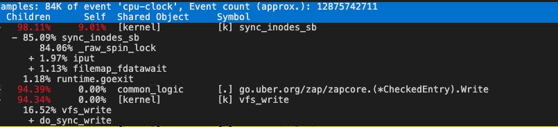
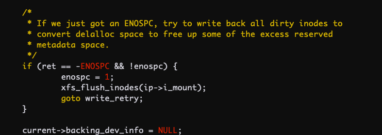

+++
title = '【公司分享学习】容器磁盘占满导致CPU飙高'
date = 2021-10-08T09:17:32+08:00
draft = false
categories = [
    "Kubernetes",
    "Docker",
    "云原生",
    "Linux内核"
]
+++

> 这是公司大佬的一次内部分享，我尝试简短总结一下

### 问题描述

某服务的其中两个副本异常，CPU 飙高。

### 指标排查

1. 查看`container_cpu_usage_seconds_total`监控，CPU 飙升，逼近 limit。

2. 查看`container_cpu_cfs_throttled_periods_total`监控，CPU 飙升伴随 CPU Throttle 飙升，所以服务异常应该是 CPU 被限流导致。

3. 查看`container_cpu_system_seconds_total`监控，发现 CPU 飙升主要是 CPU system 占用导致，容器内`pidstat -u -t 5 1`可以看到进程`%system`占用分布情况。

4. `perf top`看 system 占用高主要是 vfs_write 写数据导致。

<!--more-->
5. `iostat -xhd 2`看 IO 并不高，磁盘利用率也不高，io wait 也不高。

6. `sync_inodes_sb`看起来是写数据时触发了磁盘同步的耗时逻辑

7. 深入看内核代码，当磁盘满的时候会调用 flush 刷磁盘所有数据，这个会一直在内核态运行很久，相当于对这个文件系统做 sync。

