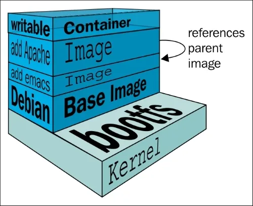

+++
title = '【云原生基础】Docker镜像存储原理及其优化方式'
date = 2020-09-24T16:23:15+08:00
draft = false
tags = [
    "云原生",
    "Docker",
    "镜像",
]
categories = [
    "Kubernetes",
    "Docker",
    "云原生",
]
+++

本文旨在通过Dockerfile的指令展开Docker镜像的原理，不再介绍Docker是什么了。

## 一、核心指令及其增强语法

### 1. 基础指令

```dockerfile
# FROM 每个 Dockerfile 都必须以 FROM 指令开始
FROM ubuntu:20.04
# RUN 执行命令并将结果打包到镜像中，通常用于安装软件或执行某些配置操作
RUN apt-get update && apt-get install -y nginx
# CMD 指定容器启动时默认执行的命令。不同于 RUN，CMD 只在容器启动时执行。
CMD ["nginx", "-g", "daemon off;"]
# ENTRYPOINT 设置容器启动时要执行的主命令。与 CMD 类似，但更适合于设置不可更改的启动命令。
# 一个Dockerfile只能有一个ENTRYPOINT，出现多个时，前面会被最后一个所覆盖
# 通常来说可以和CMD配合使用，如
# ENTRYPOINT ["nginx"]
# CMD ["-g", "daemon off;"]
# 这样启动的时候，可以通过 docker run my_image -g "daemon on;" 这种方式覆盖CMD同时保留默认启动参数的效果
ENTRYPOINT ["nginx", "-g", "daemon off;"]

WORKDIR /app

# COPY 从构建主机将文件或目录复制到镜像中
# ADD 与 COPY 类似，但可以处理本地 tar 文件的自动解压以及 URL 的下载
COPY . /app
ADD https://example.com/app.tar.gz /app

ENV APP_VERSION 1.0
# 声明容器的外部端口，但不自动发布端口
EXPOSE 80
# VOLUME 声明挂载点，将容器的数据目录映射到宿主机目录或其他容器。
# 即使不使用该指令，在docker run启动时，仍然可以使用-v或--mount进行挂载
# docker run -v <宿主机目录>:<容器内目录> <镜像名>
# docker run --mount type=bind,source=<宿主机目录>,target=<容器内目录> <镜像名>
VOLUME ["/data"]


```

### 2.基础指令上高阶用法


## 二、镜像构建原理，Layers之间的关系



<!--more-->


## 三、镜像优化

### 1. 构建速度

### 2. 镜像大小
