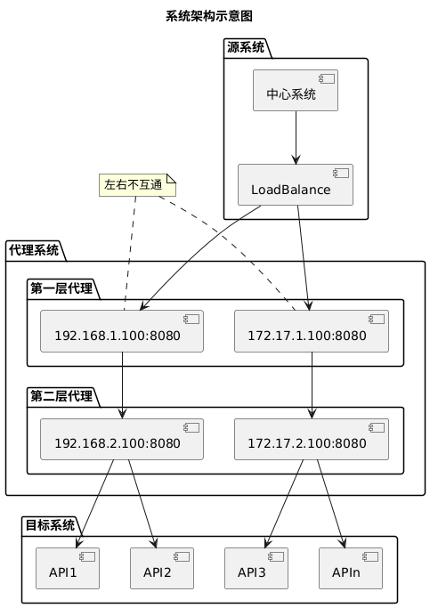

+++
title = '【生产问题】分享一次Nginx正向代理的需求'
date = 2020-04-17T11:26:41+08:00
draft = false
categories = [
    "Linux",
    "Nginx"
]
+++

> 最近接到了一个需求：通过 Nginx 代理把现网一个自研代理程序给替换掉，感觉有点意思，也有所收益，简单分享下。

部门的生产环境异常复杂，有部分第三方引入的系统位于特殊网络隔离区域，请求这些系统需要通过 2 层网络代理，如图所示：

